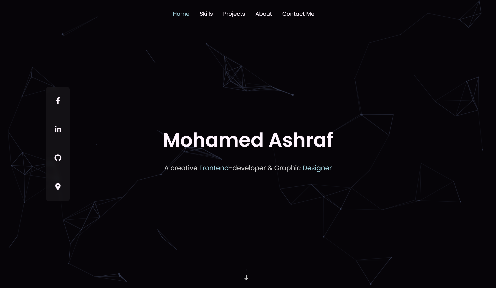
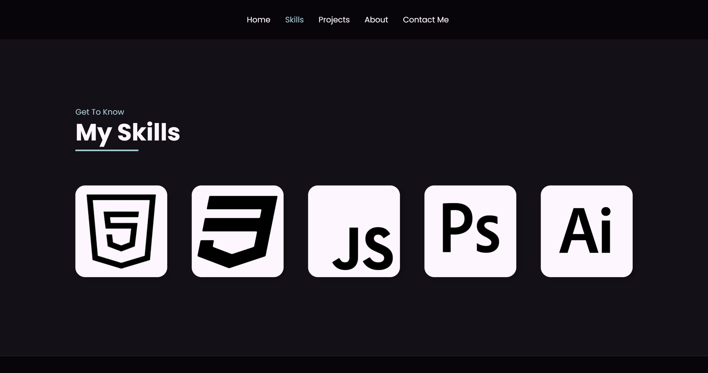
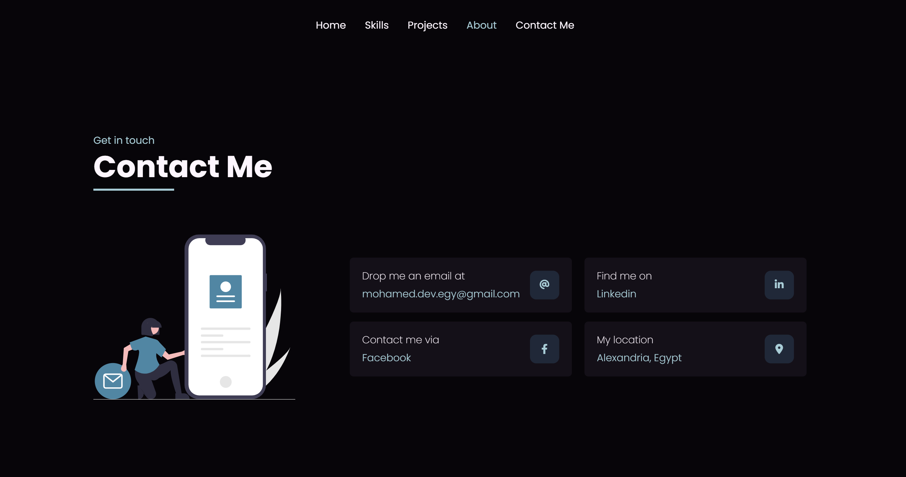
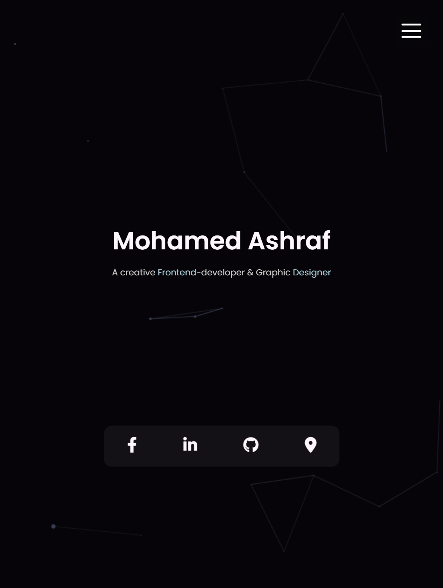

# Mohamed Ashraf's personal portfolio project

This is my personal and first portfolio i make for my self after i learned (html - css - js)

## Table of contents

- [Overview](#overview)
  - [The challenge](#the-challenge)
  - [Screenshot](#screenshot)
  - [Links](#links)
- [My process](#my-process)
  - [Built with](#built-with)
- [Author](#author)

## Overview

### Screenshot

### Links

- Live Site URL: [live](https://www.mohamed-dev.netlify.app)

## My process

### Built with

- Semantic HTML5 markup
- CSS custom properties
- Flexbox
- CSS Grid
- Vanilla JS

## Author

- Website - [All my links on my website](https://www.mohamed-dev.netlify.app)
